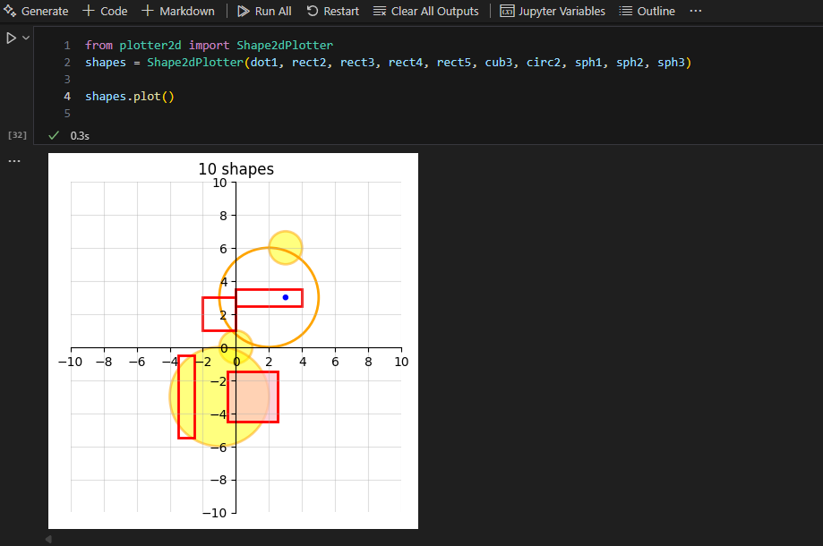

# Lab2 - Geometry
The task was to create geometric shapes that could be compared. I was also going to create a Shape2dPlotter that could plot the shapes in a coordinate system.

## UML-chart

The code consists of 5 shape classes and a class for Shape2dPlotter. All shape classes inherit from Dot.

## Classes
The code consists of 5 shape classes and a class for Shape2dPlotter. All shape classes inherit from Dot.
The two 3d classes have their respective 2d classes as compositions. This allows Shape2dPlotter to plot these as well, but in 2D.

## Shape2dPlotter
Shape2dPlotter takes in shape classes and plots them in a coordinate system. In order for the area to adapt to the size and location of the shapes, it calculates where the edge boundaries go. I also wanted both the x and y scales to be the same size and go to an even 10.

